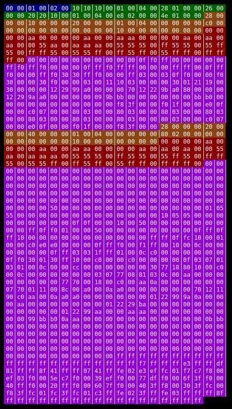

# vbincarver

This is a simple script designed to take a binary file and a grammar written in YAML and produce an HTML diagram of that binary file. Structs and offsets are highlighted according to CSS rules.

It does require a valid YAML file for the binary file to be dissected. Please see ico.yaml for an example of the Windows 3.x ICO format.

With a grammar in place, simply run it as:

> ./vbincarver.py -f ico.yaml -o example.html example.ico

## Ideas:

- Place grammars in a common location and select based on magic number.
- Chunk-based format support.
- Tool for detecting chunks or other common file format artefacts.

